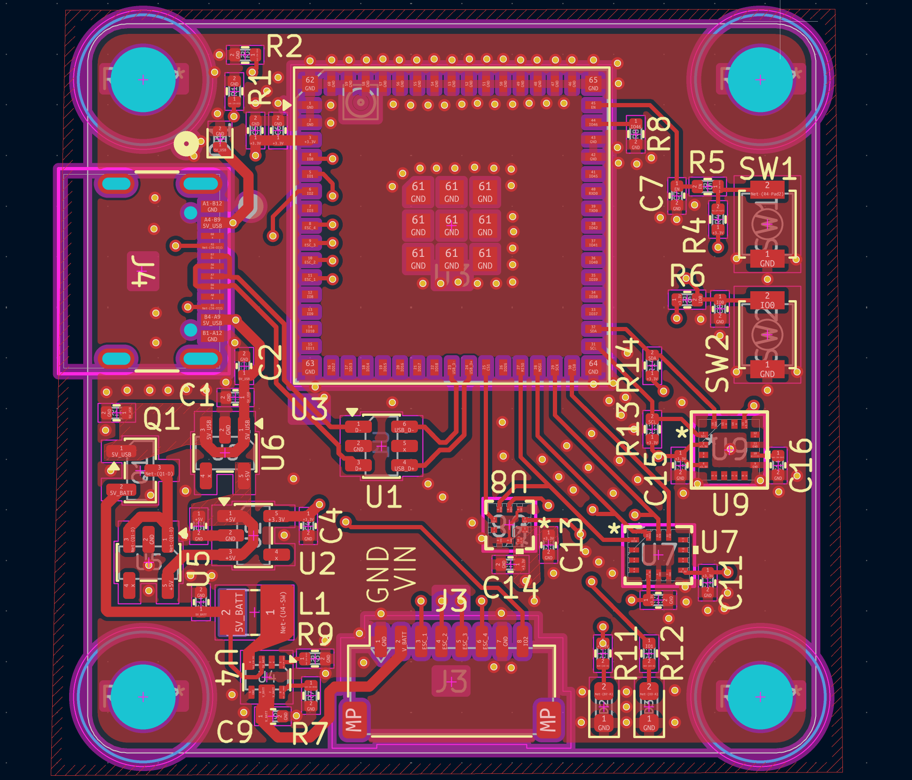
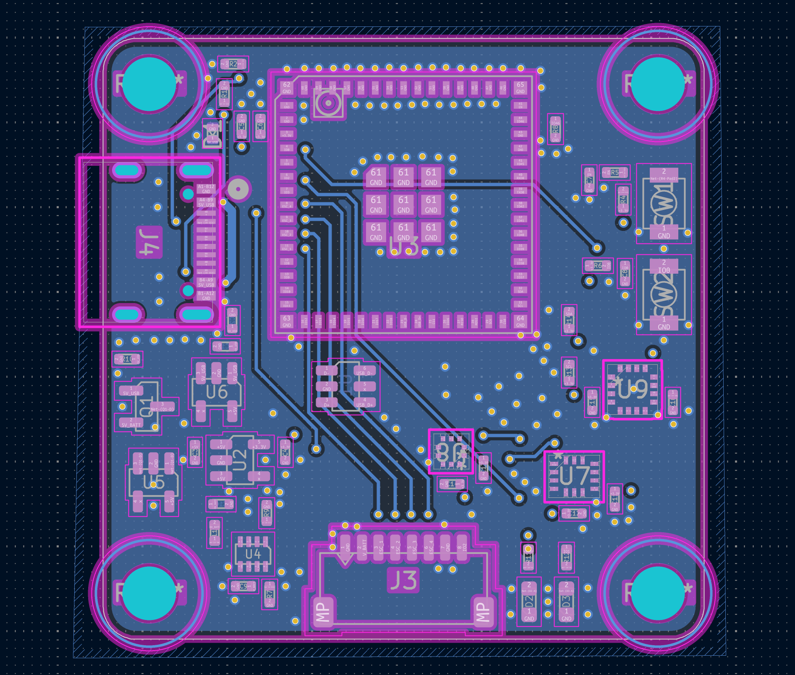
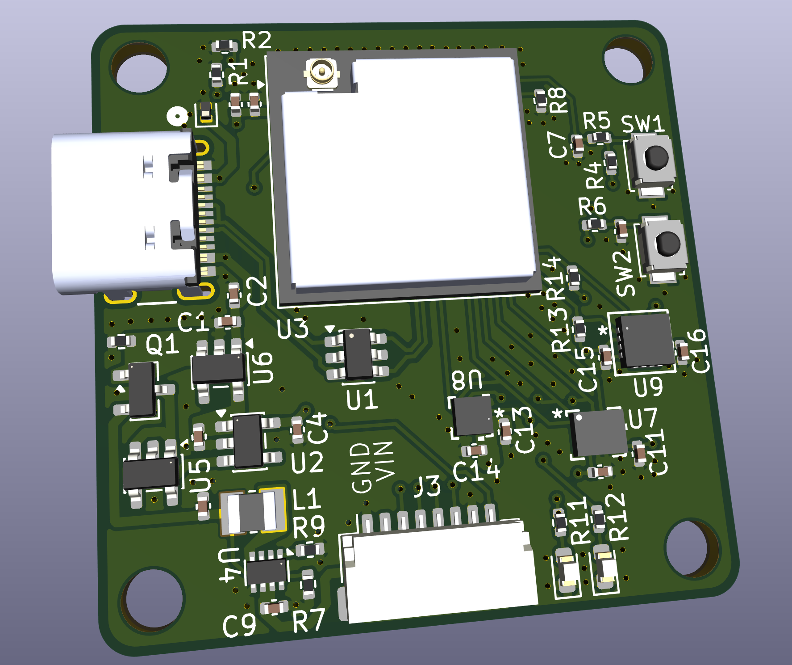

# ESP32-S3 based Flight Controller for 4S Drone

4 Layer board designed around the ESP32-S3 Mini module with external antenna
- Connects to 4 in 1 ESC via JST SH connector for power and signals
- Incorporates USB-C for firmware flashing
- Switching regulator steps down 16.8V to 5V before going through 3.3V LDO
- Accelerometer/Gyroscope Combo and Barometer connected through SPI
- Magnetometer connected through I2C

Board Stack up
- Primary Signal
- GND
- 3.3V
- Alternate Signal

Photo of top copper layer:

Photo of bottom copper layer:

Photo of 3D model:

